<!-- Profile README for github.com/thisisshivamtiwari.
     Copy this file AND the assets/ folder into the repo named thisisshivamtiwari. -->

  

  
  
  

## About

I'm an engineer-founder. In 2023 I co-founded **Retvens**, a hotel revenue-management AI company. We grew it to **2,000+ paying hotel customers** across five countries, and in February 2026 I led it through its **acquisition by RBS Software Solutions**.

Along the way I built the forecasting engine that priced rooms every night for ~200 subscribed hotels, hired a 20+ person team, and made the hardest call a builder makes: shutting down an AI product that worked, because it didn't pay.

Now I'm back in the lab at **IIT Madras** (joint M.Sc. with the University of Birmingham), going deeper on LLM agents, forecasting and the full-stack products that carry them to real users.

  

## Career

  

## Shipped to production

| Product | What it does | What I built |
|---|---|---|
| [**KnowMyHotel**](https://knowmyhotel.com) | AI revenue manager: nightly room-rate suggestions for ~200 subscribed hotels | Occupancy forecaster: **LightGBM + XGBoost + Prophet** ensemble tuned with Optuna, K-Means++ for hotels with no history, 15 leakage-safe lag features. Pricing changes A/B-tested on live room rates, up to **120% revenue uplift** at select hotels. |
| [**HotelAuditReport**](https://hotelauditreport.com) | Automated revenue audits, bought by most of our 2,000+ paying customers | Anomaly detection across PMS, channel-manager and OTA data that replaced consultant-led audits. |

## Built, measured, shelved

> [!NOTE]
> **Hotel voice concierge** — took booking and guest-service calls in English and Hindi against a live PMS.
> `Whisper` → tool-calling LLM on a `LangGraph` state machine → `ElevenLabs`.
> It worked. We shut it down before launch because the cost per call was too high to sustain.
> Knowing when *not* to ship is part of the job.

## Open work

| Repository | What it is |
|---|---|
| [**nautilusai**](https://github.com/thisisshivamtiwari/nautilusai) 🏆 | **Nutanix Hackathon winner.** Autonomous cloud-ops agent: telemetry → anomaly detection → on-prem LLM + RAG → YAML remediation through the Prism API. Incidents resolved in **under 30 s**, down from 4–6 h. |
| [**excelllm-be**](https://github.com/thisisshivamtiwari/excelllm-be) · [**fe**](https://github.com/thisisshivamtiwari/excelllm-fe) | Multi-agent LLM framework that turns spreadsheet-driven MSME workflows into agent pipelines. Walmart CTE, IIT Madras. |
| [**kaushalbot**](https://github.com/thisisshivamtiwari/kaushalbot) | Telegram agent that drafts and refines LinkedIn posts: orchestrator/worker agents on LangChain + Gemini, LinkedIn OIDC, MongoDB. |
| [**neetcode-submissions**](https://github.com/thisisshivamtiwari/neetcode-submissions) | Fundamentals, kept sharp daily. |

## Stack

  

<code>~/shivam $ exit 0</code> &nbsp;·&nbsp; built things that shipped, sold, and got acquired

